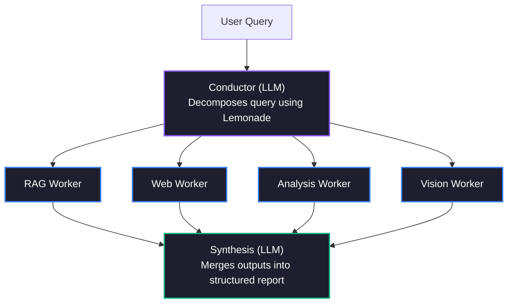

# 🐝 SwarmMind — AMD Lemonade 多智能体 AI 研究平台 🍋

> **AMD Lemonade 开发者挑战赛 2026 参赛作品**
> 一个本地优先的多智能体研究协作系统，**由 Lemonade 全能模型提供动力**
> *作为推动 AMD 硬件上本地多智能体 AI 发展的深度生态系统贡献而构建。*

[](https://python.org)
[](https://github.com/lemonade-sdk/lemonade)
[](../LICENSE)

---

**🌐 Read this in your language:** **[简体中文](README.cn.md)** | [हिन्दी](README.hi.md) | [日本語](README.ja.md) | [Français](README.fr.md)

---

## 🎯 SwarmMind 是什么？

SwarmMind 是一个**多智能体 AI 研究助手**，能够将复杂的研究查询分解为并行子任务，同时运行多个专门的 Worker 智能体，并综合生成结构化报告——所有功能均通过 [Lemonade SDK](https://github.com/lemonade-sdk/lemonade) 在 AMD 硬件上**100% 本地运行**。

### Swarm 架构



---

## ✨ 功能特性

- **🧠 多智能体编排** — Conductor 负责分解查询；多个 Worker 并行独立研究
- **🔍 RAG（检索增强生成）** — 基于 ChromaDB 的私有文档搜索
- **🌐 网络搜索** — 集成 DuckDuckGo 实现实时网页检索
- **⚡ 并行或顺序执行** — 选择并行（快速）或顺序（低内存）Worker 执行模式
- **🖥️ AMD 硬件检测** — 自动检测 Ryzen AI NPU、ROCm GPU，并推荐最佳后端
- **🎨 Lemonade 全能模型** — 原生多模态处理！利用 Qwen3.6-35B-A3B 进行视觉处理、Flux 生成图表、Kokoro 进行语音合成。
- **📊 结构化报告** — 执行摘要、章节、矛盾点、后续问题
- **📤 导出** — 支持 Markdown 和 HTML 报告导出
- **🖥️ 专业级 UI** — 暗色玻璃拟态设计，三面板布局

---

## 🚀 快速开始

> **评审老师？** 请参阅 [安装指南](../SETUP.md) 获取详细说明。

### 前置要求

1. **AMD Lemonade** 已安装并运行：
   ```bash
   pip install lemonade-sdk
   lemonade-server start
   ```

2. **Python 3.11+**，配合 uv 或 pip

### 安装

```bash
git clone https://github.com/rahulgupta0-dev/swarmmind.git
cd swarmmind

# Create virtual environment
python -m venv .venv
source .venv/bin/activate

# Install with dev dependencies
pip install -e ".[dev]"

# Verify installation
swarmmind --help
```

### 运行

```bash
# Launch the Streamlit web UI
swarmmind web

# Or run a CLI query
swarmmind ask "What is AMD Ryzen AI?"

# Or run the smoke test (requires Lemonade server)
bash tests/smoke_test.sh
```

在浏览器中打开 http://localhost:8501。

---

## 🔧 配置

SwarmMind 通过 Lemonade 的 /v1/system-info 端点自动检测 AMD 硬件：

| 硬件 | 后端 | 用途 |
|---|---|---|
| AMD Ryzen AI NPU (XDNA 2) | ryzenai | Conductor（低延迟） |
| AMD Radeon GPU (ROCm) | rocm | Worker（高吞吐） |
| AMD CPU (llama.cpp) | cpu | 备选方案 |

---

## 🏗️ 架构

```
swarmmind/
├── core/
│   ├── orchestrator.py  # Main pipeline coordinator
│   ├── conductor.py     # Query decomposition (LLM)
│   ├── workers.py       # RAG / Web / Analysis / Code workers
│   ├── synthesis.py     # Multi-worker report synthesis (LLM)
│   └── hardware.py      # AMD hardware detection & backend routing
├── lemonade/
│   └── client.py        # Async Lemonade API client
├── rag/
│   └── chroma_store.py  # ChromaDB RAG implementation
├── data/
│   └── database.py      # SQLite project/conversation storage
└── ui/
    ├── app.py           # Streamlit app entry point
    └── panels/
        ├── chat.py      # Research query & results panel
        ├── sources.py   # Project & source management
        └── studio.py    # Export, notes & Lemonade status
```

---

## 📝 AMD Lemonade 集成

SwarmMind 使用以下 Lemonade 端点：

| 端点 | 用途 |
|---|---|
| GET /v1/health | 连接健康检查 |
| POST /v1/chat/completions | 所有 LLM 推理（Conductor、Worker、综合报告） |
| POST /v1/load | 预加载 Conductor 模型 |
| POST /v1/embeddings | RAG 文档向量化 |
| GET /v1/system-info | AMD 硬件检测（NPU/GPU/CPU） |
| GET /v1/stats | Token 吞吐量指标 |

---

## 💻 CLI 参考

| 命令 | 说明 |
|---|---|
| `swarmmind ask <query>` | 从终端运行研究查询 |
| `swarmmind ask <query> --no-web` | 禁用本次查询的网络搜索 |
| `swarmmind ask <query> --sequential` | 顺序运行 Worker（适用于低内存系统） |
| `swarmmind ask <query> --project-id <id>` | 将查询限定到特定项目的来源 |
| `swarmmind project create <name>` | 创建新的研究项目 |
| `swarmmind project list` | 列出所有项目 |
| `swarmmind source add <project> <type> <uri>` | 添加来源（pdf、youtube、web、text） |
| `swarmmind source list <project>` | 列出项目中的来源 |
| `swarmmind report list <project>` | 列出项目的过往报告 |
| `swarmmind config show` | 显示当前配置 |
| `swarmmind benchmark` | 运行 AMD 跨后端基准测试 |
| `swarmmind web` | 启动 Streamlit Web UI |

---

## ⚙️ 配置

SwarmMind 将配置存储在 `~/.swarmmind/config.toml`：

```toml
[lemonade]
host = "localhost"
port = 13305

[models]
conductor = "Qwen3.6-35B-A3B-GGUF"
worker = "Gemma-4-12B-it"
embeddings = "nomic-embed-text-v1-GGUF"
image = "Flux-2-Klein-4B"
tts = "kokoro-v1"

[rag]
chunk_size = 512
chunk_overlap = 64
top_k = 5

[execution]
mode = "parallel"        # "parallel" (fast) or "sequential" (low-RAM)
max_concurrent = 4        # Limit parallel workers (1-16)
```

### 执行模式

SwarmMind 支持两种 Worker 执行模式，以适应不同硬件环境：

| 模式 | 速度 | 内存占用 | 适用场景 |
|---|---|---|---|
| `parallel`（默认） | ⚡ 快速 — Worker 同时运行 | 较高 — 同时进行多次 LLM 调用 | 32 GB+ 内存（Strix Halo、高端 GPU） |
| `sequential` | 🐢 较慢 — 一次运行一个 Worker | 较低 — 一次进行一次 LLM 调用 | 8-16 GB 内存（笔记本电脑、旧款硬件） |

```bash
# CLI: Force sequential mode
swarmmind ask "Compare RAG vs fine-tuning" --sequential

# Config: Set via config.toml
[execution]
mode = "sequential"
max_concurrent = 1
```

在 **Web UI** 中，可在**设置**面板（左侧边栏）切换执行模式。

硬件自动检测会将每个模型角色路由到最佳可用后端：

| 硬件 | 后端 | 用途 |
|---|---|---|
| AMD Ryzen AI NPU (XDNA 2) | ryzenai | 向量化（低功耗、稳定状态） |
| AMD Radeon GPU (ROCm) | rocm | Conductor 与 Worker（高吞吐） |
| AMD CPU (llama.cpp) | cpu | 备选方案 / 语音合成 |

可在 `config.toml` 中手动指定后端：

```toml
[models.backends]
conductor = "rocm"
worker = "rocm"
embeddings = "ryzenai"
image = "rocm"
tts = "cpu"
```

---

## 📄 许可证

Apache 2.0 — 完整条款请参阅 [LICENSE](../LICENSE)。

---

## 📚 文档

| 文档 | 说明 |
|---|---|
| [安装指南](../SETUP.md) | 评审设置说明、故障排除 |
| [CHANGELOG.md](../CHANGELOG.md) | TDD 审计修复与方法论 |
| [README.md](../README.md) | 架构、功能、CLI 参考 |

---

*为 AMD Lemonade 开发者挑战赛 2026 而倾心构建 ❤️*