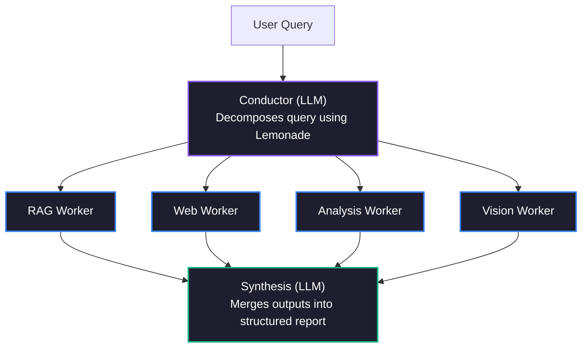

# 🐝 SwarmMind — Plateforme de recherche IA multi-agents AMD Lemonade 🍋

> **Participation au AMD Lemonade Developer Challenge 2026**
> Un système de recherche collaborative multi-agents à priorité locale, **alimenté par le modèle polyvalent Lemonade**
> *Construit comme une contribution écosystémique profonde pour promouvoir l'IA multi-agents locale sur le matériel AMD.*

[](https://python.org)
[](https://github.com/lemonade-sdk/lemonade)
[](../LICENSE)

---

**🌐 Read this in your language:** [简体中文](README.cn.md) | [हिन्दी](README.hi.md) | [日本語](README.ja.md) | **[Français](README.fr.md)**

---

## 🎯 Qu'est-ce que SwarmMind ?

SwarmMind est un **assistant de recherche IA multi-agents** capable de décomposer des requêtes de recherche complexes en sous-tâches parallèles, d'exécuter simultanément plusieurs agents Worker spécialisés et de générer des rapports structurés — le tout **100% en local** sur du matériel AMD via le [Lemonade SDK](https://github.com/lemonade-sdk/lemonade).

### Architecture Swarm



---

## ✨ Fonctionnalités

- **🧠 Orchestration multi-agents** — Le Conductor décompose les requêtes ; plusieurs Workers effectuent des recherches indépendantes en parallèle
- **🔍 RAG (Retrieval-Augmented Generation)** — Recherche de documents privés basée sur ChromaDB
- **🌐 Recherche Web** — Intégration de DuckDuckGo pour une recherche web en temps réel
- **⚡ Exécution parallèle ou séquentielle** — Choisissez entre le mode parallèle (rapide) ou séquentiel (faible mémoire) pour l'exécution des Workers
- **🖥️ Détection du matériel AMD** — Détection automatique du Ryzen AI NPU, ROCm GPU, et recommandation du meilleur backend
- **🎨 Modèle polyvalent Lemonade** — Traitement multimodal natif ! Utilisation de Qwen3.6-35B-A3B pour le traitement visuel, Flux pour la génération de graphiques, Kokoro pour la synthèse vocale.
- **📊 Rapports structurés** — Résumé d'exécution, sections, contradictions, questions de suivi
- **📤 Export** — Export de rapports en Markdown et HTML
- **🖥️ Interface professionnelle** — Design glassmorphisme sombre, mise en page à trois panneaux

---

## 🚀 Démarrage rapide

> **Évaluateur ?** Veuillez consulter le [guide d'installation](../SETUP.md) pour des instructions détaillées.

### Prérequis

1. **AMD Lemonade** installé et en cours d'exécution :
   ```bash
   pip install lemonade-sdk
   lemonade-server start
   ```

2. **Python 3.11+**, avec uv ou pip

### Installation

```bash
git clone https://github.com/rahulgupta0-dev/swarmmind.git
cd swarmmind

# Create virtual environment
python -m venv .venv
source .venv/bin/activate

# Install with dev dependencies
pip install -e ".[dev]"

# Verify installation
swarmmind --help
```

### Exécution

```bash
# Launch the Streamlit web UI
swarmmind web

# Or run a CLI query
swarmmind ask "What is AMD Ryzen AI?"

# Or run the smoke test (requires Lemonade server)
bash tests/smoke_test.sh
```

Ouvrez http://localhost:8501 dans votre navigateur.

---

## 🔧 Configuration

SwarmMind détecte automatiquement le matériel AMD via l'endpoint /v1/system-info de Lemonade :

| Matériel | Backend | Usage |
|---|---|---|
| AMD Ryzen AI NPU (XDNA 2) | ryzenai | Conductor (faible latence) |
| AMD Radeon GPU (ROCm) | rocm | Worker (haut débit) |
| AMD CPU (llama.cpp) | cpu | Alternative |

---

## 🏗️ Architecture

```
swarmmind/
├── core/
│   ├── orchestrator.py  # Main pipeline coordinator
│   ├── conductor.py     # Query decomposition (LLM)
│   ├── workers.py       # RAG / Web / Analysis / Code workers
│   ├── synthesis.py     # Multi-worker report synthesis (LLM)
│   └── hardware.py      # AMD hardware detection & backend routing
├── lemonade/
│   └── client.py        # Async Lemonade API client
├── rag/
│   └── chroma_store.py  # ChromaDB RAG implementation
├── data/
│   └── database.py      # SQLite project/conversation storage
└── ui/
    ├── app.py           # Streamlit app entry point
    └── panels/
        ├── chat.py      # Research query & results panel
        ├── sources.py   # Project & source management
        └── studio.py    # Export, notes & Lemonade status
```

---

## 📝 Intégration AMD Lemonade

SwarmMind utilise les endpoints Lemonade suivants :

| Endpoint | Usage |
|---|---|
| GET /v1/health | Vérification de santé de la connexion |
| POST /v1/chat/completions | Tous les raisonnements LLM (Conductor, Worker, rapport synthétisé) |
| POST /v1/load | Préchargement du modèle Conductor |
| POST /v1/embeddings | Vectorisation des documents RAG |
| GET /v1/system-info | Détection du matériel AMD (NPU/GPU/CPU) |
| GET /v1/stats | Métriques de débit de tokens |

---

## 💻 Référence CLI

| Commande | Description |
|---|---|
| `swarmmind ask <query>` | Exécuter une requête de recherche depuis le terminal |
| `swarmmind ask <query> --no-web` | Désactiver la recherche Web pour cette requête |
| `swarmmind ask <query> --sequential` | Exécuter les Workers en séquentiel (pour les systèmes à faible mémoire) |
| `swarmmind ask <query> --project-id <id>` | Limiter la requête aux sources d'un projet spécifique |
| `swarmmind project create <name>` | Créer un nouveau projet de recherche |
| `swarmmind project list` | Lister tous les projets |
| `swarmmind source add <project> <type> <uri>` | Ajouter une source (pdf, youtube, web, text) |
| `swarmmind source list <project>` | Lister les sources du projet |
| `swarmmind report list <project>` | Lister les rapports passés du projet |
| `swarmmind config show` | Afficher la configuration actuelle |
| `swarmmind benchmark` | Exécuter le benchmark cross-backend AMD |
| `swarmmind web` | Lancer l'interface Web Streamlit |

---

## ⚙️ Configuration

SwarmMind stocke la configuration dans `~/.swarmmind/config.toml` :

```toml
[lemonade]
host = "localhost"
port = 13305

[models]
conductor = "Qwen3.6-35B-A3B-GGUF"
worker = "Gemma-4-12B-it"
embeddings = "nomic-embed-text-v1-GGUF"
image = "Flux-2-Klein-4B"
tts = "kokoro-v1"

[rag]
chunk_size = 512
chunk_overlap = 64
top_k = 5

[execution]
mode = "parallel"        # "parallel" (fast) or "sequential" (low-RAM)
max_concurrent = 4        # Limit parallel workers (1-16)
```

### Mode d'exécution

SwarmMind supporte deux modes d'exécution des Workers pour s'adapter à différents environnements matériels :

| Mode | Vitesse | Utilisation mémoire | Scénarios adaptés |
|---|---|---|---|
| `parallel` (par défaut) | ⚡ Rapide — Les Workers s'exécutent simultanément | Élevée — Plusieurs appels LLM simultanés | Mémoire 32 GB+ (Strix Halo, GPU haut de gamme) |
| `sequential` | 🐢 Plus lent — Un Worker à la fois | Faible — Un appel LLM à la fois | Mémoire 8-16 GB (ordinateurs portables, matériel ancien) |

```bash
# CLI: Force sequential mode
swarmmind ask "Compare RAG vs fine-tuning" --sequential

# Config: Set via config.toml
[execution]
mode = "sequential"
max_concurrent = 1
```

Dans l'**interface Web**, vous pouvez basculer le mode d'exécution dans le panneau **Paramètres** (barre latérale gauche).

La détection automatique du matériel route chaque rôle de modèle vers le meilleur backend disponible :

| Matériel | Backend | Usage |
|---|---|---|
| AMD Ryzen AI NPU (XDNA 2) | ryzenai | Vectorisation (faible consommation, état stable) |
| AMD Radeon GPU (ROCm) | rocm | Conductor et Worker (haut débit) |
| AMD CPU (llama.cpp) | cpu | Alternative / Synthèse vocale |

Vous pouvez spécifier manuellement le backend dans `config.toml` :

```toml
[models.backends]
conductor = "rocm"
worker = "rocm"
embeddings = "ryzenai"
image = "rocm"
tts = "cpu"
```

---

## 📄 Licence

Apache 2.0 — Pour les conditions complètes, veuillez consulter [LICENSE](../LICENSE).

---

## 📚 Documentation

| Document | Description |
|---|---|
| [Guide d'installation](../SETUP.md) | Instructions de configuration pour les évaluateurs, dépannage |
| [CHANGELOG.md](../CHANGELOG.md) | Corrections d'audit TDD et méthodologie |
| [README.md](../README.md) | Architecture, fonctionnalités, référence CLI |

---

*Construit avec passion pour le AMD Lemonade Developer Challenge 2026 ❤️*