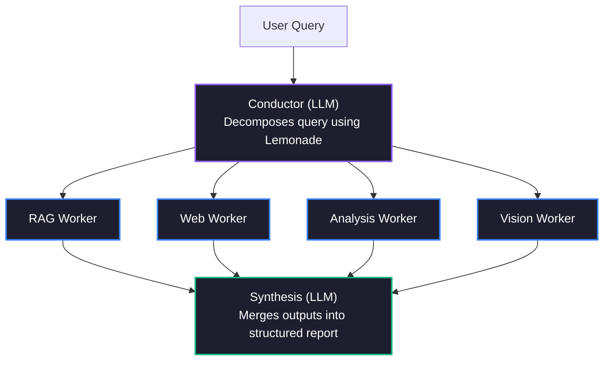

# 🐝 SwarmMind — AMD Lemonade पर मल्टी-एजेंट AI रिसर्च 🍋

> **AMD Lemonade डेवलपर चैलेंज 2026 सबमिशन**
> एक लोकल-फ़र्स्ट, मल्टी-एजेंट रिसर्च स्वार्म — **Lemonade Omni Models द्वारा संचालित**
> *AMD हार्डवेयर पर लोकल मल्टी-एजेंट AI को आगे बढ़ाने के लिए एक गहरे इकोसिस्टम योगदान के रूप में बनाया गया।*

[](https://python.org)
[](https://github.com/lemonade-sdk/lemonade)
[](../LICENSE)

---

**🌐 Read this in your language:** [简体中文](README.cn.md) | **[हिन्दी](README.hi.md)** | [日本語](README.ja.md) | [Français](README.fr.md)

---

## 🎯 SwarmMind क्या है?

SwarmMind एक **मल्टी-एजेंट AI रिसर्च असिस्टेंट** है जो जटिल रिसर्च क्वेरी को पैरेलल सब-टास्क में विभाजित करता है, स्पेशियलाइज़्ड वर्कर एजेंट्स को एक साथ चलाता है, और एक स्ट्रक्चर्ड रिपोर्ट संश्लेषित करता है — यह सब [Lemonade SDK](https://github.com/lemonade-sdk/lemonade) के माध्यम से AMD हार्डवेयर पर **100% लोकल** चलता है।

### Swarm आर्किटेक्चर



---

## ✨ विशेषताएँ

- **🧠 मल्टी-एजेंट ऑर्केस्ट्रेशन** — Conductor क्वेरी को विभाजित करता है; पैरेलल वर्कर्स स्वतंत्र रूप से रिसर्च करते हैं
- **🔍 RAG (Retrieval-Augmented Generation)** — प्राइवेट डॉक्यूमेंट सर्च के लिए ChromaDB
- **🌐 वेब सर्च** — रीयल-टाइम वेब रिज़ल्ट के लिए DuckDuckGo इंटीग्रेशन
- **⚡ पैरेलल या सीक्वेंशियल एक्ज़ीक्यूशन** — पैरेलल (तेज़) या सीक्वेंशियल (कम रैम) वर्कर एक्ज़ीक्यूशन चुनें
- **🖥️ AMD हार्डवेयर डिटेक्शन** — Ryzen AI NPU, ROCm GPU को ऑटो-डिटेक्ट करता है और बेस्ट बैकएंड रिकमेंड करता है
- **🎨 Lemonade Omni Models** — नेटिव मल्टीमोडल प्रोसेसिंग! विज़न के लिए Qwen3.6-35B-A3B, डायग्राम के लिए Flux, और TTS के लिए Kokoro।
- **📊 स्ट्रक्चर्ड रिपोर्ट** — एक्ज़ीक्यूटिव समरी, सेक्शंस, कंट्रैडिक्शंस, फ़ॉलो-अप क्वेश्चंस
- **📤 एक्सपोर्ट** — Markdown और HTML रिपोर्ट एक्सपोर्ट
- **🖥️ प्रोफेशनल UI** — डार्क ग्लास्मॉर्फिज़्म डिज़ाइन, 3-पैनल लेआउट

---

## 🚀 क्विक स्टार्ट

> **जज?** विस्तृत निर्देशों के लिए [सेटअप गाइड](../SETUP.md) देखें।

### प्रीरिक्वाइज़िट्स

1. **AMD Lemonade** इंस्टॉल और रनिंग हो:
   ```bash
   pip install lemonade-sdk
   lemonade-server start
   ```

2. **Python 3.11+** uv या pip के साथ

### इंस्टॉलेशन

```bash
git clone https://github.com/rahulgupta0-dev/swarmmind.git
cd swarmmind

# Create virtual environment
python -m venv .venv
source .venv/bin/activate

# Install with dev dependencies
pip install -e ".[dev]"

# Verify installation
swarmmind --help
```

### रन करें

```bash
# Launch the Streamlit web UI
swarmmind web

# Or run a CLI query
swarmmind ask "What is AMD Ryzen AI?"

# Or run the smoke test (requires Lemonade server)
bash tests/smoke_test.sh
```

अपने ब्राउज़र में http://localhost:8501 खोलें।

---

## 🔧 कॉन्फ़िगरेशन

SwarmMind Lemonade के /v1/system-info एंडपॉइंट के माध्यम से आपके AMD हार्डवेयर को ऑटो-डिटेक्ट करता है:

| हार्डवेयर | बैकएंड | उपयोग |
|---|---|---|
| AMD Ryzen AI NPU (XDNA 2) | ryzenai | Conductor (लो-लेटेंसी) |
| AMD Radeon GPU (ROCm) | rocm | Workers (हाई-थ्रूपुट) |
| AMD CPU (llama.cpp) | cpu | फ़ॉलबैक |

---

## 🏗️ आर्किटेक्चर

```
swarmmind/
├── core/
│   ├── orchestrator.py  # Main pipeline coordinator
│   ├── conductor.py     # Query decomposition (LLM)
│   ├── workers.py       # RAG / Web / Analysis / Code workers
│   ├── synthesis.py     # Multi-worker report synthesis (LLM)
│   └── hardware.py      # AMD hardware detection & backend routing
├── lemonade/
│   └── client.py        # Async Lemonade API client
├── rag/
│   └── chroma_store.py  # ChromaDB RAG implementation
├── data/
│   └── database.py      # SQLite project/conversation storage
└── ui/
    ├── app.py           # Streamlit app entry point
    └── panels/
        ├── chat.py      # Research query & results panel
        ├── sources.py   # Project & source management
        └── studio.py    # Export, notes & Lemonade status
```

---

## 📝 AMD Lemonade इंटीग्रेशन

SwarmMind निम्नलिखित Lemonade एंडपॉइंट्स का उपयोग करता है:

| एंडपॉइंट | उद्देश्य |
|---|---|
| GET /v1/health | कनेक्शन हेल्थ चेक |
| POST /v1/chat/completions | सभी LLM इनफ़ेरेंस (Conductor, Workers, Synthesis) |
| POST /v1/load | Conductor मॉडल प्री-लोड |
| POST /v1/embeddings | RAG डॉक्यूमेंट एम्बेडिंग |
| GET /v1/system-info | AMD हार्डवेयर डिटेक्शन (NPU/GPU/CPU) |
| GET /v1/stats | टोकन थ्रूपुट मेट्रिक्स |

---

## 💻 CLI रेफ़रेंस

| कमांड | विवरण |
|---|---|
| `swarmmind ask <query>` | टर्मिनल से रिसर्च क्वेरी चलाएँ |
| `swarmmind ask <query> --no-web` | इस क्वेरी के लिए वेब सर्च अक्षम करें |
| `swarmmind ask <query> --sequential` | Workers सीक्वेंशियल चलाएँ (कम रैम सिस्टम के लिए सुरक्षित) |
| `swarmmind ask <query> --project-id <id>` | क्वेरी को किसी विशिष्ट प्रोजेक्ट के सोर्सेज़ तक सीमित करें |
| `swarmmind project create <name>` | नया रिसर्च प्रोजेक्ट बनाएँ |
| `swarmmind project list` | सभी प्रोजेक्ट सूचीबद्ध करें |
| `swarmmind source add <project> <type> <uri>` | सोर्स जोड़ें (pdf, youtube, web, text) |
| `swarmmind source list <project>` | प्रोजेक्ट के सोर्सेज़ सूचीबद्ध करें |
| `swarmmind report list <project>` | प्रोजेक्ट की पिछली रिपोर्ट सूचीबद्ध करें |
| `swarmmind config show` | वर्तमान कॉन्फ़िगरेशन दिखाएँ |
| `swarmmind benchmark` | AMD क्रॉस-बैकएंड बेंचमार्क चलाएँ |
| `swarmmind web` | Streamlit Web UI लॉन्च करें |

---

## ⚙️ कॉन्फ़िगरेशन

SwarmMind कॉन्फ़िगरेशन `~/.swarmmind/config.toml` में स्टोर करता है:

```toml
[lemonade]
host = "localhost"
port = 13305

[models]
conductor = "Qwen3.6-35B-A3B-GGUF"
worker = "Gemma-4-12B-it"
embeddings = "nomic-embed-text-v1-GGUF"
image = "Flux-2-Klein-4B"
tts = "kokoro-v1"

[rag]
chunk_size = 512
chunk_overlap = 64
top_k = 5

[execution]
mode = "parallel"        # "parallel" (fast) or "sequential" (low-RAM)
max_concurrent = 4        # Limit parallel workers (1-16)
```

### एक्ज़ीक्यूशन मोड

SwarmMind विभिन्न हार्डवेयर के अनुकूल दो वर्कर एक्ज़ीक्यूशन मोड सपोर्ट करता है:

| मोड | स्पीड | रैम उपयोग | सर्वोत्तम |
|---|---|---|---|
| `parallel` (डिफ़ॉल्ट) | ⚡ तेज़ — वर्कर्स एक साथ चलते हैं | अधिक — एक साथ कई LLM कॉल्स | 32 GB+ रैम (Strix Halo, हाई-एंड GPU) |
| `sequential` | 🐢 धीमा — एक बार में एक वर्कर | कम — एक समय में एक LLM कॉल | 8-16 GB रैम (लैपटॉप, पुराने हार्डवेयर) |

```bash
# CLI: Force sequential mode
swarmmind ask "Compare RAG vs fine-tuning" --sequential

# Config: Set via config.toml
[execution]
mode = "sequential"
max_concurrent = 1
```

**Web UI** में, **Settings** पैनल (बायाँ साइडबार) में एक्ज़ीक्यूशन मोड टॉगल करें।

हार्डवेयर ऑटो-डिटेक्शन प्रत्येक मॉडल रोल को बेस्ट उपलब्ध बैकएंड पर रूट करता है:

| हार्डवेयर | बैकएंड | उपयोग |
|---|---|---|
| AMD Ryzen AI NPU (XDNA 2) | ryzenai | एम्बेडिंग्स (कम-पावर, स्टेडी-स्टेट) |
| AMD Radeon GPU (ROCm) | rocm | Conductor और Workers (हाई-थ्रूपुट) |
| AMD CPU (llama.cpp) | cpu | फ़ॉलबैक / TTS |

`config.toml` में मैन्युअली बैकएंड पिन करें:

```toml
[models.backends]
conductor = "rocm"
worker = "rocm"
embeddings = "ryzenai"
image = "rocm"
tts = "cpu"
```

---

## 📄 लाइसेंस

Apache 2.0 — पूरी शर्तें [LICENSE](../LICENSE) में देखें।

---

## 📚 दस्तावेज़

| दस्तावेज़ | विवरण |
|---|---|
| [सेटअप गाइड](../SETUP.md) | जज सेटअप निर्देश, समस्या निवारण |
| [CHANGELOG.md](../CHANGELOG.md) | TDD ऑडिट फ़िक्स और मेथडोलॉजी |
| [README.md](../README.md) | आर्किटेक्चर, विशेषताएँ, CLI रेफ़रेंस |

---

*AMD Lemonade डेवलपर चैलेंज 2026 के लिए ❤️ से बनाया गया*
