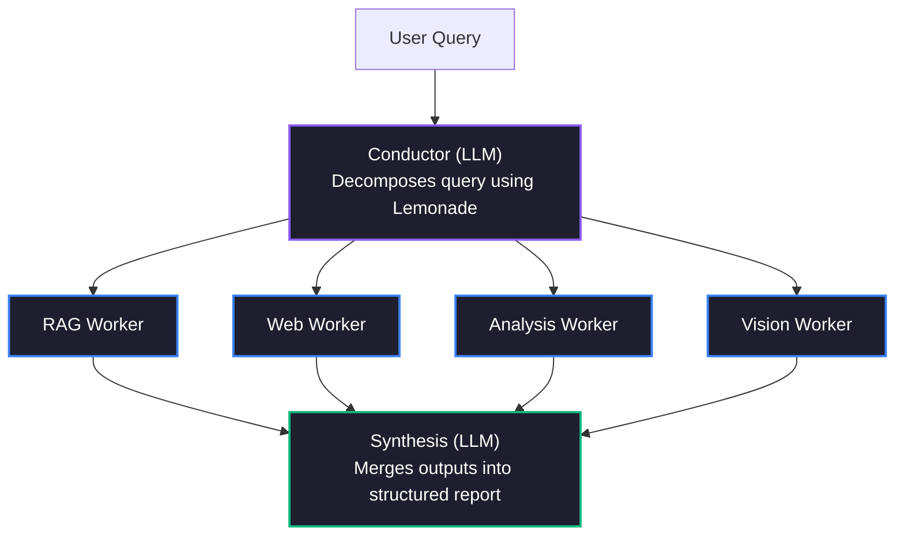

# 🐝 SwarmMind — AMD Lemonade マルチエージェント AI 研究プラットフォーム 🍋

> **AMD Lemonade 開発者チャレンジ 2026 出品作品**
> ローカルファーストのマルチエージェント研究協働システム — **Lemonade オムニモデルによって駆動**
> *AMD ハードウェア上のローカルマルチエージェント AI を推進するための、深いエコシステム貢献として構築。*

[](https://python.org)
[](https://github.com/lemonade-sdk/lemonade)
[](../LICENSE)

---

**🌐 Read this in your language:** [简体中文](README.cn.md) | [हिन्दी](README.hi.md) | **[日本語](README.ja.md)** | [Français](README.fr.md)

---

## 🎯 SwarmMind とは？

SwarmMind は、複雑な研究クエリを並列サブタスクに分解し、専門化されたワーカーエージェントを同時に実行し、構造化されたレポートを統合的に生成する**マルチエージェント AI 研究アシスタント**です。これらすべての機能は [Lemonade SDK](https://github.com/lemonade-sdk/lemonade) を介して AMD ハードウェア上で **100% ローカル**に実行されます。

### Swarm アーキテクチャ



---

## ✨ 主な機能

- **🧠 マルチエージェントオーケストレーション** — Conductor がクエリを分解し、複数のワーカーが並列で個別にリサーチを実行
- **🔍 RAG（検索拡張生成）** — ChromaDB ベースのプライベートドキュメント検索
- **🌐 ウェブ検索** — DuckDuckGo によるリアルタイムウェブ検索の統合
- **⚡ 並列または逐次実行** — 並列（高速）または逐次（低メモリ）ワーカー実行モードを選択
- **🖥️ AMD ハードウェア検出** — Ryzen AI NPU、ROCm GPU を自動検出し、最適なバックエンドを推奨
- **🎨 Lemonade オムニモデル** — ネイティブマルチモーダル処理！ビジョンに Qwen3.6-35B-A3B、グラフ生成に Flux、音声合成に Kokoro。
- **📊 構造化レポート** — エグゼクティブサマリー、セクション、矛盾点、フォローアップ質問
- **📤 エクスポート** — Markdown および HTML レポートのエクスポート対応
- **🖥️ プロフェッショナル UI** — ダーク グラスモフィズム デザイン、3 パネル レイアウト

---

## 🚀 クイックスタート

> **審査員の方へ？** 詳細な手順は[セットアップガイド](../SETUP.md)をご覧ください。

### 前提条件

1. **AMD Lemonade** がインストール済みで動作中であること：
   ```bash
   pip install lemonade-sdk
   lemonade-server start
   ```

2. **Python 3.11+**（uv または pip 使用）

### インストール

```bash
git clone https://github.com/rahulgupta0-dev/swarmmind.git
cd swarmmind

# Create virtual environment
python -m venv .venv
source .venv/bin/activate

# Install with dev dependencies
pip install -e ".[dev]"

# Verify installation
swarmmind --help
```

### 実行

```bash
# Launch the Streamlit web UI
swarmmind web

# Or run a CLI query
swarmmind ask "What is AMD Ryzen AI?"

# Or run the smoke test (requires Lemonade server)
bash tests/smoke_test.sh
```

ブラウザで http://localhost:8501 を開いてください。

---

## 🔧 設定

SwarmMind は Lemonade の /v1/system-info エンドポイントを通じて AMD ハードウェアを自動検出します：

| ハードウェア | バックエンド | 用途 |
|---|---|---|
| AMD Ryzen AI NPU (XDNA 2) | ryzenai | Conductor（低レイテンシ） |
| AMD Radeon GPU (ROCm) | rocm | ワーカー（高スループット） |
| AMD CPU (llama.cpp) | cpu | フォールバック |

---

## 🏗️ アーキテクチャ

```
swarmmind/
├── core/
│   ├── orchestrator.py  # Main pipeline coordinator
│   ├── conductor.py     # Query decomposition (LLM)
│   ├── workers.py       # RAG / Web / Analysis / Code workers
│   ├── synthesis.py     # Multi-worker report synthesis (LLM)
│   └── hardware.py      # AMD hardware detection & backend routing
├── lemonade/
│   └── client.py        # Async Lemonade API client
├── rag/
│   └── chroma_store.py  # ChromaDB RAG implementation
├── data/
│   └── database.py      # SQLite project/conversation storage
└── ui/
    ├── app.py           # Streamlit app entry point
    └── panels/
        ├── chat.py      # Research query & results panel
        ├── sources.py   # Project & source management
        └── studio.py    # Export, notes & Lemonade status
```

---

## 📝 AMD Lemonade 統合

SwarmMind は以下の Lemonade エンドポイントを使用します：

| エンドポイント | 目的 |
|---|---|
| GET /v1/health | 接続ヘルスチェック |
| POST /v1/chat/completions | すべての LLM 推論（Conductor、ワーカー、レポート統合） |
| POST /v1/load | Conductor モデルのプリロード |
| POST /v1/embeddings | RAG ドキュメントのベクトル化 |
| GET /v1/system-info | AMD ハードウェア検出（NPU/GPU/CPU） |
| GET /v1/stats | トークンスループットメトリクス |

---

## 💻 CLI リファレンス

| コマンド | 説明 |
|---|---|
| `swarmmind ask <query>` | ターミナルからリサーチクエリを実行 |
| `swarmmind ask <query> --no-web` | このクエリでウェブ検索を無効化 |
| `swarmmind ask <query> --sequential` | ワーカーを逐次実行（低メモリシステム向け） |
| `swarmmind ask <query> --project-id <id>` | クエリを特定プロジェクトのソースに限定 |
| `swarmmind project create <name>` | 新しいリサーチプロジェクトを作成 |
| `swarmmind project list` | すべてのプロジェクトを一覧表示 |
| `swarmmind source add <project> <type> <uri>` | ソースを追加（pdf、youtube、web、text） |
| `swarmmind source list <project>` | プロジェクトのソースを一覧表示 |
| `swarmmind report list <project>` | プロジェクトの過去のレポートを一覧表示 |
| `swarmmind config show` | 現在の設定を表示 |
| `swarmmind benchmark` | AMD クロスバックエンドベンチマークを実行 |
| `swarmmind web` | Streamlit Web UI を起動 |

---

## ⚙️ 設定

SwarmMind の設定は `~/.swarmmind/config.toml` に保存されます：

```toml
[lemonade]
host = "localhost"
port = 13305

[models]
conductor = "Qwen3.6-35B-A3B-GGUF"
worker = "Gemma-4-12B-it"
embeddings = "nomic-embed-text-v1-GGUF"
image = "Flux-2-Klein-4B"
tts = "kokoro-v1"

[rag]
chunk_size = 512
chunk_overlap = 64
top_k = 5

[execution]
mode = "parallel"        # "parallel" (fast) or "sequential" (low-RAM)
max_concurrent = 4        # Limit parallel workers (1-16)
```

### 実行モード

SwarmMind は、さまざまなハードウェア環境に対応するため、2 種類のワーカー実行モードをサポートしています：

| モード | スピード | メモリ使用量 | 最適な用途 |
|---|---|---|---|
| `parallel`（デフォルト） | ⚡ 高速 — ワーカーが同時に実行 | 高い — 複数の LLM 呼び出しが同時進行 | 32 GB+ メモリ（Strix Halo、ハイエンド GPU） |
| `sequential` | 🐢 ゆっくり — 一度に1つのワーカー | 低い — 一度に1つの LLM 呼び出し | 8-16 GB メモリ（ラップトップ、レガシーハードウェア） |

```bash
# CLI: Force sequential mode
swarmmind ask "Compare RAG vs fine-tuning" --sequential

# Config: Set via config.toml
[execution]
mode = "sequential"
max_concurrent = 1
```

**Web UI** では、**Settings** パネル（左サイドバー）から実行モードを切り替えられます。

ハードウェアの自動検出により、各モデルロールが最適な利用可能なバックエンドにルーティングされます：

| ハードウェア | バックエンド | 用途 |
|---|---|---|
| AMD Ryzen AI NPU (XDNA 2) | ryzenai | ベクトル化（低消費電力、定常状態） |
| AMD Radeon GPU (ROCm) | rocm | Conductor とワーカー（高スループット） |
| AMD CPU (llama.cpp) | cpu | フォールバック / TTS |

`config.toml` で手動でバックエンドを指定することもできます：

```toml
[models.backends]
conductor = "rocm"
worker = "rocm"
embeddings = "ryzenai"
image = "rocm"
tts = "cpu"
```

---

## 📄 ライセンス

Apache 2.0 — 詳細は [LICENSE](../LICENSE) をご覧ください。

---

## 📚 ドキュメント

| ドキュメント | 説明 |
|---|---|
| [セットアップガイド](../SETUP.md) | 審査員向けセットアップ手順、トラブルシューティング |
| [CHANGELOG.md](../CHANGELOG.md) | TDD 監査修正および方法論 |
| [README.md](../README.md) | アーキテクチャ、機能、CLI リファレンス |

---

*AMD Lemonade 開発者チャレンジ 2026 に込めて ❤️*
